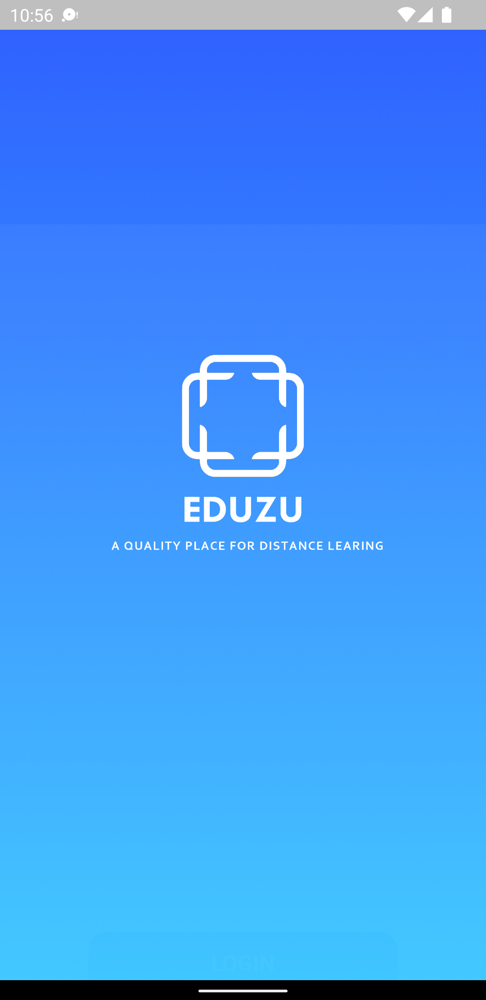
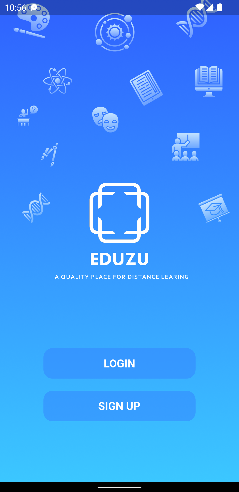
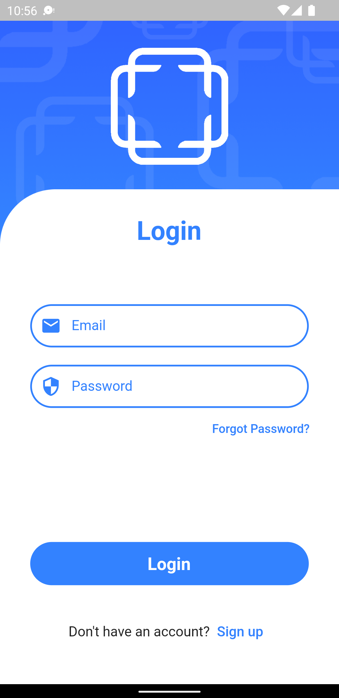
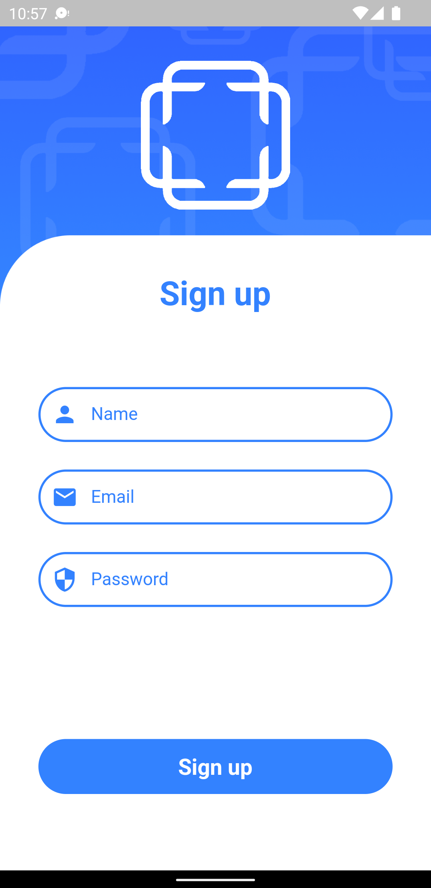
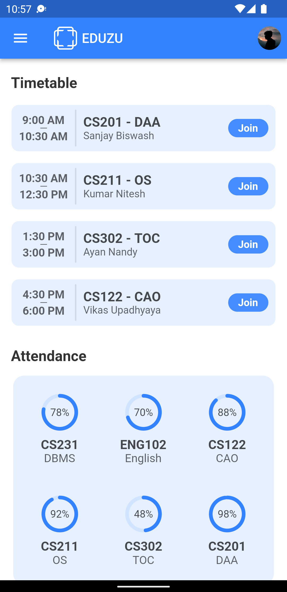
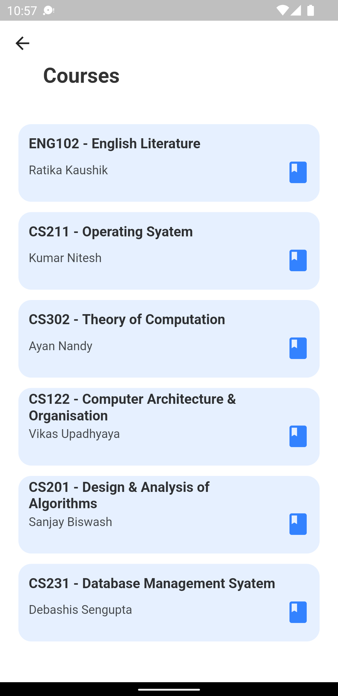
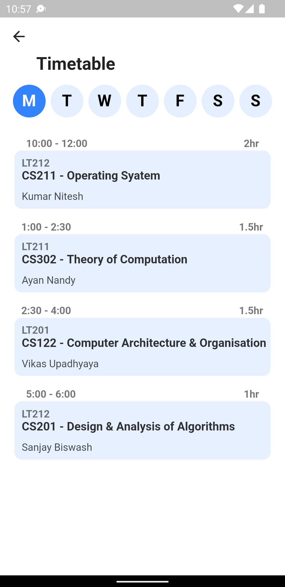
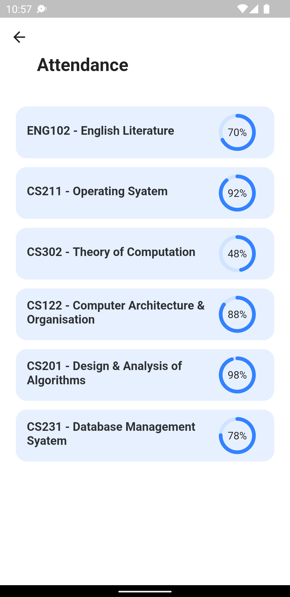

# EDUZU

EDUZU is a highly functional app that has been built using the Flutter framework, a popular open-source mobile application development platform. For its backend needs, the app also uses Supabase, an open-source Backend as a Service (BaaS) platform.

EDUZU has a simple and attractive user interface thanks to Flutter, and the rich backend functionality of Supabase improves its functionality. EDUZU is able to provide dependable data storage, secure user authentication.

 - Watch the [video](https://drive.google.com/file/d/1s6ZIieXFJPno81klTbHFSt3vPStNA5dM/view?usp=sharing) of the application

## Preview

  
   
  
  

  
   
  
  

